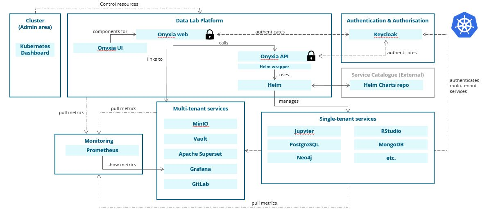

# Architecture
The Data Lab concept is envisioned to allow users to request in a self-service fashion their own analytical infrastructure and use it at will. To do so, it is necessary to set-up a way to provision this self-service and the common services that will enable authentication, storage, secrets management, monitoring, data visualisation and collaboration. In order to achieve a Cloud Native and Agnostic version of the Data Lab, every part of the Data Lab should be provisioned through [Docker](https://www.docker.com/) containers in [Kubernetes](https://kubernetes.io/), through [Helm](https://helm.sh/) installations.

## :warning: Disclaimer :warning:
The documentation is still in development and may be subject to future changes.

## Table of Contents
0. [Terminology](#terminology)
1. [High-level architecture](#high-level-architecture)
2. [Kubernetes set-up](#kubernetes-set-up)
3. [Multi-tenant Services](#multi-tenant-services)  
    1.1. [Onyxia](#onyxia)  
    1.2. [Identity and Access Management](#identity-and-access-management)  
    1.3. [Storage](#storage)   
    1.4. [Secrets management](#secrets-management)  
    1.5. [Monitoring](#monitoring)  
    1.6. [Data Visualisation](#data-visualisation)  
    1.7. [Collaboration tools](#collaboration-tools)
    1.7. [Collaboration tools](#collaboration-tools)  
    1.8. [Admin Area](#admin-area)

# Terminology
In the following documentation a Kubernetes standard terminology will be used, with the exception and additions of:
- *Service*: defines an installed or installable `Helm` chart for the Data Lab, to be provided to a user in a self-service basis through the Data Lab. Not to be confused with Kubernetes Service abstraction.
- *Single-tenant*: reference to Services that will be created and accessed by a single user on the Data Lab.
- *Multi-tenant*: common Services that are provided to every user that is authenticated in the Data Lab.
- *Catalog*: a grouping of single-tenant Services for the user's self-service.
- *Groups*: a grouping of users that belongs to the same *Project*, sharing resources in the datalab.

# High-level architecture
The Data Lab will reside in Kubernetes, so it will be independent of the Cloud Provider. In order to provide the Data Lab, a selected number of components interact, in a high-level overview, as shown in the following diagram.

The main component of the Data Lab is [Onyxia](https://github.com/InseeFrLab/onyxia), where users will have access to a web interface and:
- Deploy and manage their own single-tenant services in a self-service fashion
- Access multi-tenant services (either through Onyxia web interface **OR** through the service provided web interface)

[Keycloak](https://www.keycloak.org/) will do identity and access management with:
- Authentication, based on the [Open ID Connect](https://openid.net/connect/) or [OAuth 2.0](https://oauth.net/2/), for Onyxia and multi-tenant services (i.e., MinIO, Vault, Grafana, Apache Superset, and GitLab)
- Authorisation, managed by the platform administrator on Keycloak's administrator portal, through `jwt` claims

[MinIO](https://min.io/) will serve as the storage provider.

[Vault](https://www.vaultproject.io/) will serve as the secrets manager service.

[CKAN](https://ckan.org/) will serve as the Data Catalog.

[Prometheus](https://prometheus.io/) and [Grafana](https://grafana.com/) will be for the monitoring and observation, to provide dashboards with user's consumption and platform load.

[Apache Superset](https://superset.apache.org/) will be the data visualisation service.

[GitLab](https://about.gitlab.com/) will be the projects and code collaboration tool.

[Kubernetes Dashboard](https://kubernetes.io/docs/tasks/access-application-cluster/web-ui-dashboard/) will be an extra tool for the platform admins to be able to interactively interact with the Kubernetes cluster.

# Kubernetes set-up
If setting up the Kubernetes cluster on-premises, do not take into account the Availability Zones mentions during this section. Ensure that you are able to expose the IP or DNS of the load balancer on your reverse proxy and create the CNAME as mentioned in the [DEPLOYMENT](./DEPLOYMENT.md) document.

If setting up the Kubernetes cluster in a Cloud Provider, you can use any of the existing Cloud Providers, since the infrastructure for the Data Lab should be abstracted through Kubernetes. Take into consideration that:
- **High Availability**: your control plane should span across three Availability Zones and your worker nodes should be set into auto-scaling groups across three Availability Zones (or spread evenly across the Availability Zones them if the auto-scaling group feature is not possible).
- **Resource managing**: label two types of workers. Multi-tenant worker nodes with increased resources, labeled for the multi-tenant services, and single-tenant worker nodes, with increased scalability for the self-service infrastructure requests.

For AWS there is an example detailed in the [DEPLOYMENT](./DEPLOYMENT.md) document.

# Multi-tenant Services
## Onyxia
Onyxia will be the main service manager, offering a web interface through which users can self-service their own analytical needs. Onyxia itself uses [Helm](https://helm.sh/) to install the analytical services on a [Kubernetes](https://kubernetes.io/) containerized system, which implies the use of `Helm` repositories for the service offering. For more information on developments, refer to [Onyxia @ INSEE](https://github.com/InseeFrLab/onyxia).

The modules of Onyxia can be found in the following repositories:

| Module @ InseeFrLab | Module @ Eurostat | Description | Status |
| ------------------- | ----------------- | ----------- | ------ |
| [Onyxia WEB](https://github.com/inseefrlab/onyxia-web) | [Onyxia WEB](https://github.com/eurostat/onyxia-api) | Web UI (`React`)                      | :white_check_mark:     |
| [Onyxia API](https://github.com/inseefrlab/onyxia-api) | [Onyxia API](https://github.com/eurostat/onyxia-api) | Kubernetes API (`Java / Spring-boot`) | :white_check_mark:     |
| [Onyxia-UI](https://github.com/InseeFrLab/onyxia-ui)   | | Design system and React UI toolkit    | :white_check_mark:     |
| [Onyxia CLI](https://github.com/inseefrlab/onyxia-cli) | | Command line application (`Go`)       | :large_orange_diamond: |

The Onyxia compliant `Helm` repositories to be used as Service Catalogs are the following:

| Repository                                                                       | Purpose                                                    | Status             |
| -------------------------------------------------------------------------------- | ---------------------------------------------------------- | ------------------ |
| [Helm charts datascience](https://github.com/inseefrlab/helm-charts-datascience) | Datascience catalog using `Helm` (for `Kubernetes`) format | :white_check_mark: |

## Identity and Access Management
Identity and Access Management will be handled by a [Keycloak](https://www.keycloak.org/) installation on Kubernetes for the multi-tenant services. It will provide authentication for:
- Onyxia to request single-tenant services or access the web interface.
- MinIO to interact with the object storage.
- Vault to interact with the secrets management service.  
- Grafana to access monitoring dashboards.
- Apache Superset to access cross-community data visualisations.
- GitLab to access the project and code collaboration tools.

Authorisation for the multi-tenant services will be made through the `jwt` claims so that users will only be able to interact with their own resources, even in multi-tenant services. Currently, it is necessary to define:
- MinIO STS policies and client `policy` claim.  
- Vault policies.  

Authentication for the single-tenant services, after launch, will be done through an uniquely generated link and a login password. The service itself has the possibility to be protected by a Kubernetes Network Policy to restrict only a namespace and an IP whitelisting that ensures only the IP of the end-user that requested the service will be able to access the service.

### Keycloak install
To ensure a Highly Available IAM provider, Keycloak has to be deployed at least with a [Standalone Clustered](https://www.keycloak.org/docs/latest/server_installation/#_standalone-ha-mode) mode. The configuration implies:
- Multiple replicas with pod affinity set to distribute them along the nodes.
- A node discovery method, that can use the Kubernetes API (e.g., `KUBE_PING`).
- An external PostgreSQL database, with a Persistent Volume Claim to allow persistence over pod alteration.
- StatefulSet to ensure a unique node identifier to manage database transactions.
- `PROXY_ADDRESS_FORWARDING` set to `true` since it will sit behind a reverse proxy.
- Cache owners count bigger than one, for the cache persistence if one pod fails.

For an easier deployment curated charts at codocentric or bitnami are available through [Codocentric GitHub](https://github.com/codecentric/helm-charts) and [Bitnami GitHub](https://github.com/bitnami/charts). These already include settings for the deployment of a PostgreSQL database and configuration options within their `values.yaml` to allow a Highly Available install.

### Keycloak configuration
For the Data Lab we will have two realms:
- Master Realm: the default Keycloak realm for the platform administrators.
- Data Lab Realm: the realm created for the Data Lab application, which will in turn have multiple clients for authentication (e.g., Onyxia, MinIO, Grafana, etc.). 

> This configurations should be automated during launching of the Data Lab service, for more information consult the [DEPLOYMENT.md](./DEPLOYMENT.md) document.

As a platform administrator, the setting and revoking of permissions is done manually to the users through the administrator interface.

## Storage

As the platform takes a stateless architecture, there is no need for extra databases (besides the required one for Keycloak back-end). On the other hand, there is the possibility for users to use an in-app storage to save, use and share data. This storage will be managed by the external service [MinIO](https://min.io/).

> MinIO is a high performance distributed object storage server, designed for large-scale private cloud infrastructure. MinIO is designed in a cloud-native manner to scale sustainably in multi-tenant environments. Orchestration platforms like Kubernetes provide perfect cloud-native environment to deploy and scale MinIO.

### MinIO install

The instalation of MinIO does not depend on any extra external services, however, to achieve High Availability, Reliability, and Cloud Agnosticity in the MinIO service, the distributed MinIO should be built without dependency on underlying services besides Kubernetes objects.

> If you are aware of stand-alone MinIO set up, the process remains largely the same.

The configuration implies:
- Distributed set up with sizing as recommended per official documentation [GitHub MinIO Sizing](https://github.com/minio/minio/blob/master/docs/distributed/SIZING.md).
- Use Persistent Volumes for MinIO through Persistent Volume Claims (and do not use MinIO as a Gateway).
- Do **NOT** use NFS as underlying file system to keep consistency guarantee.

For more information on this architecture decisions visit the [official MinIO documentation](https://docs.min.io/docs/distributed-minio-quickstart-guide.html).

### MinIO configuration

The purpose of adding a simple storage service is for users to have their own storage environment, to that end these assumptions were made:
- Each user has access to a bucket with their own ID (i.e., `userid` = `bucketid`)
- Each user has access to buckets from their groups (i.e., `groupid` = `bucketid`)

To enable this access control is done through `jwt` claims of the Keycloak client created for MinIO (e.g., `preferred_username`, `groups`), and enforced through MinIO STS Policies. These policies need to be updated periodically to ensure group changes are propagated from Keycloak. To that end a CronJob should be in place to ensure that synchronization.

> This configurations should be automated during launching of the Data Lab service, for more information consult the [DEPLOYMENT.md](./DEPLOYMENT.md) or the [Chart README](../charts/datalab/README.md) document. 

More information on how to configure MinIO for Onyxia can be found on [Onyxia GitHub](https://github.com/InseeFrLab/onyxia).

## Secrets management

The chosen secrets management service was [Vault](https://www.vaultproject.io/). It was included in the platform for users to store their own secrets, that they can later use in the single-tenant services. It is also used for storing [user preferences](https://github.com/InseeFrLab/onyxia-web/blob/efc32a9ccc2339dec0c4a4c63be5797023c00e14/src/lib/useCases/userConfigs.ts#L29-L40) in Onyxia, namely the password for single-tenant services, since Onyxia is stateless (as mentioned [here](https://github.com/InseeFrLab/onyxia-web/blob/docs.onyxia.dev/README.md)).

Vault helps a platform manage secrets and protect sensitive data. 

> Secure, store and tightly control access to tokens, passwords, certificates, encryption keys for protecting secrets and other sensitive data using a UI, CLI, or HTTP API.

### Vault install

To have a reliable and available secretes management service it is necessary to:
- Deploy multiple replicas (on a StatefulSet) with affinity to distribute over nodes.
- Use Persistent Volume Claims for Vault's [Integrated Storage](https://www.vaultproject.io/docs/configuration/storage/raft), with the `retry_join` configuration set.

Since Vault replicates data across nodes following the [Raft Consensus Algorithm](https://raft.github.io/), replicas will ensure availability and resilience.

For more about deployments on Kubernetes refer to the [Vault documentation](https://learn.hashicorp.com/tutorials/vault/kubernetes-raft-deployment-guide?in=vault/kubernetes#configure-vault-helm-chart).

### Vault configuration

Vault users should be able to authenticate themselves with their token, and be restricted to their own secrets, for that it is necessary to:
- Enable `jwt` support in Vault.
- Create a role for the Data Lab Users.
- Configure policies for user access based on `preferred_name` and `groups` claim and initialize secret engine.

> This configurations are to be ran in a script after launching of the Data Lab service, for more information consult the [DEPLOYMENT.md](./DEPLOYMENT.md) or the [Chart README](../charts/datalab/README.md) document. 

More information on how to configure Vault for Onyxia can be found on [Onyxia GitHub](https://github.com/InseeFrLab/onyxia).

## Data Catalog
A Data Catalog service will be implemented by [CKAN](https://ckan.org/).

### CKAN configuration
CKAN can (optionally) be deployed with the rest of the platform, it is necessary to keep in mind that most CKAN configurations have to be made in the image itself, for more information consult the [Chart README](../charts/datalab/README.md) document.

## Monitoring

Monitoring will be done with [Prometheus](https://prometheus.io/) and [Grafana](https://grafana.com/). The purpose of the monitoring solution is to:
- Allow platform administrators to monitor the usage of the Data Lab by the users
- Allow platform administrators to set notification systems for resource consumption and inactivity
- Allow users to track their own consumption for resources.

For that it is necessary to have a comprehensive monitoring solution, with exposed dashboards behind an authentication layer. 

### Prometheus and Grafana install
To do it throughly it is necessary to:
- Export node metrics ([node exporter](https://github.com/prometheus/node_exporter))
- Export Kubernetes metrics ([kube state metrics](https://github.com/kubernetes/kube-state-metrics))
- Export application metrics on the `/metrics` endpoint for the multi-tenant services (i.e., Keycloak, MinIO, etc.)
- Collect all metrics ([Prometheus](https://prometheus.io/))
- Create alerts ([Prometheus Altermanager](https://github.com/prometheus/alertmanager))
- Display metrics for observation ([Grafana](https://grafana.com/))
- Ensure availability of the monitoring system.

For more information on a Prometheus based monitoring for Kubernetes check the repository [Kube-Prometheus](https://github.com/prometheus-operator/kube-prometheus).

### Prometheus and Grafana configuration
The current architecture does not plan any discrete authorisation layer on the monitoring visualisation, i.e., every user will be able to monitor the entire system. For future implementations it is advisable to restrict users monitoring to their own namespaces.

Authentication should be provided by Keycloak with industry standard OAuth 2.0 protocol.

> This configurations should be automated during launching of the Data Lab service, for more information consult the [Chart README](../charts/datalab/README.md) document. 

## Data Visualisation
The multi-tenant data visualisation service, for users to share and build dashboards together, will be handled by [Apache Superset](https://superset.apache.org/).

### Apache Superset install

To have a reliable and available data visualisation service it is necessary to:
- Deploy multiple replicas with affinity to distribute over nodes.
- Guarantee persistence of `PVC` over pod deletes.

For more information visit [Apache Superset on Kubernetes](https://superset.apache.org/docs/installation/running-on-kubernetes).

### Apache Superset configuration
Authentication should be provided by Keycloak with industry standard OpenID Connect, where the assigned role to users can depend on the `jwt` claims

> This configurations should be automated during launching of the Data Lab service, for more information consult the [Chart README](../charts/datalab/README.md) document. 

## Collaboration tools
Project documentation and code collaboration will be handled by [GitLab](https://about.gitlab.com/).

### GitLab install

To have a reliable and available project documentation and code collaboration service it is necessary to:
- Deploy multiple replicas with affinity to distribute over nodes.
- Guarantee persistence of `PVC` over pod deletes.

For more information visit [GitLab Helm Chart](https://docs.gitlab.com/charts/).

### GitLab configuration
Authentication should be provided by Keycloak with industry standard OpenID Connect.

> This configurations should be automated during launching of the Data Lab service, for more information consult the [Chart README](../charts/datalab/README.md) document. 

 

## Admin Area
### Kubernetes Dashboard
The Kubernetes Dashboard will be an extra tool for the platform admins to be able to interact with the Kubernetes cluster, in addition to the Kubernetes CLI.
 The integration of this tool in the Datalab is optional,  and doesn't require much configuration. For further details on this chart's configuration, consult the [Chart README](../charts/datalab/README.md) document. 
In orther to understand how to access this tool, consult the [OPERATING](../docs/OPERATING.md) document. 
